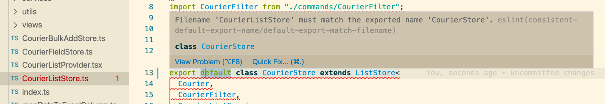
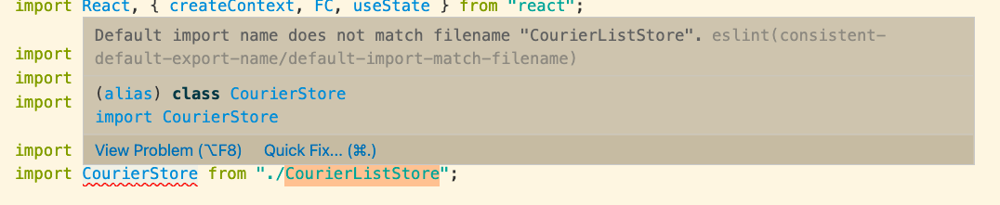

# eslint-plugin-consistent-default-export-name

Adds rules to help use consistent "default export" names throughout the project.

This plugin is basically a repackaging of two rules, each from two separate plugins:

1. __default-export-match-filename__: checks when filename does not match its default export name
    

2. __default-import-match-filename__: checks when default import name does not match its source filename
    

If both rules are activated, default names will be consistent overall.

## I DID NOT WRITE THE RULES

- Thanks to @selaux who wrote the rule (filenames/match-exported) and made `eslint-plugin-filenames`
- Thanks to @golopot who wrote the rule and made PR to `eslint-plugin-import`

## How To Use

1. either extend config which enables both rules

    ```json
    {
        "extends": ["plugin:consistent-default-export-name/fixed"]
    }
    ```

    which, sets below

    ```json
    {
        "rules": {
            "consistent-default-export-name/default-export-match-filename": "error",
            "consistent-default-export-name/default-import-match-filename": "error"
        }
    }
    ```

2. or set rules inidividually

    ```json
    {
        "rules": {
            "consistent-default-export-name/default-export-match-filename": "error",
        }
    }
    ```

## Rule Option & Documentation

- [default-export-match-filename](./docs/rules/default-export-match-filename.md)
- [default-import-match-filename](./docs/rules/default-import-match-filename.md)

## Installation

```shell
npm install eslint-plugin-consistent-default-export-name --save-dev
```

```shell
yarn add -D eslint-plugin-consistent-default-export-name
```

## Supported Rules

- default-export-match-filename
- default-import-match-filename

## Github

[https://github.com/minseoksuh/eslint-plugin-consistent-default-export-name/blob/main/README.md](https://github.com/minseoksuh/eslint-plugin-consistent-default-export-name/blob/main/README.md)
